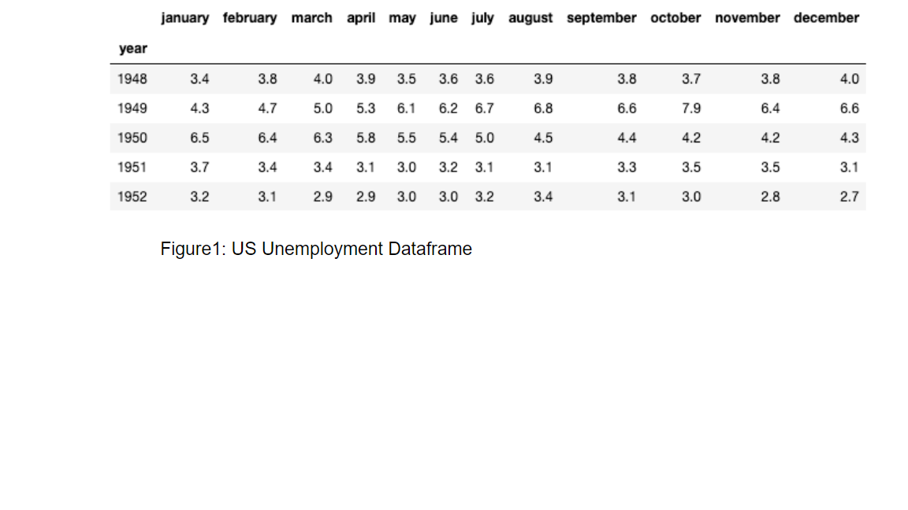

[Project Report](https://docs.google.com/document/d/10paAE3xX_7CimcTwOF3twK5LvelXhFmDSesd-P8gdZc/edit?ts=5ed2ad3f "Project Report")

## Data Cleanup & Analysis
### The sources of data :
 We used two data sources. Both were CSV files.
1.     US Unemployment : Each years monthly unemployment rate from 1948 to 2019
Link: https://www.kaggle.com/tunguz/us-monthly-unemployment-rate-1948-present

2.     US GDP: Yearly US GDP from 1930 to 2015
Link: https://datahub.io/core/gdp-us

The type of transformation:
Cleaning and Filtering
The type of final production database:
        	We used a relational database, Postgres, to load our final production data.
The final tables or collections used:

